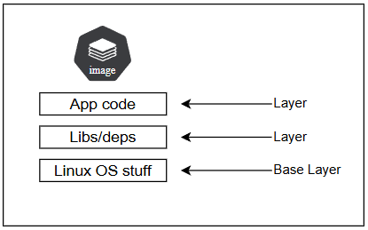

# Welcome | Course Introduction

<figure><figcaption></figcaption></figure>

<figure><figcaption></figcaption></figure>

<figure><figcaption></figcaption></figure>

\-----

* Learn Kubernetes: A Deep Dive

